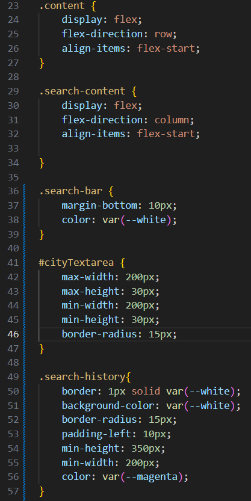
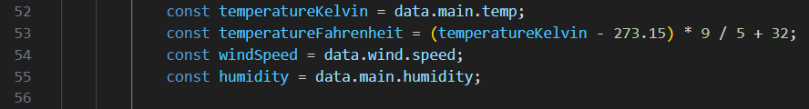
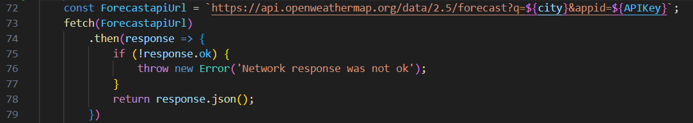

# Weather-Dashboard

The goal for this assignment was to make a website display a weather forecast for the upcoming week using a weather forecast API.

The start of the HTML is normal beginning code in HTML.

The next section of the HTML is the search elements, the header, the search bar, and the search list that is required for the assignment. The CSS does it's job to make the webpage look better aesthetically, I won't go into detail of what all of it does since CSS is fairly straightforeward, especially with the example of this section of the webpage that corrilates with the CSS.

This section of the HTML is responsible for the current weather display, composed to be the main focus of the webpage.

The rest of the HTML provides divs that will be used for the 5 day forecasts.

The start of the Javascript, as many Javascripts do, starts with constant global variables that need to be referenced throughout the entire code.

The first functions of the Javascript are to establish the searchbar function, preventing the textbox from doing the default when pressing enter (unless the User is olding shift), and then performing alternative functions when enter is pressed. The second function saves the user input into local storage and sets the city variable as the user input. After running two functions relating to saving the city name to local storage and updating the on screen search history, the button down function clears the search textbox, then runs the last function, the currentweather function.

The currentweather function starts by fetching data from the API, setting the API variable locally. The fetch will either return response, or run an error if the reponse cannot be fetched.

Now with the data from the API, the function starts with setting the image to corrolate with the weather according to the api. It's then followed by constants that are holding the data needed for the current weather forecast.

This part of the function is to display the city name and the current date as the header of the currentweather div.

The rest of this section of the function is changing the HTML elements so it'll display the needed weather information, that being the temperature, humidity, and wind speed. The function ends with an error check, so if any of the function doesn't work it will run an error.

The function continues after this, now moving onto the five day forecast. This section fetches data from the API again, since the last Fetch only retrieves the weather from the current day.

The function here works similarly to the previous section of the function, the only major differences is the for loop so that every forecast divs displays their weather data, and the HTML elements aren't changing existing elements, rather adding elements. The end of this section of the function ends with updating the images to be relavent to the forecast weather. Again there is an error catch for the end of this function, and this is the end to the whole function.

The next function makes it so that when the user enters a city into the searchbar, it gets saved to local storage as an array so that the search history section of the page will have all necassary information.

This function is what makes the search history list on the webpage by retrieving the array made by the last function and creating a list item for each item in the array, then giving them the text content of each item.

The last function is an event listener, so when the user clicks onto any of the list items the webpage with run the currentweather function again except with the clicked city instead of having to type and enter a city in the search textbox.

